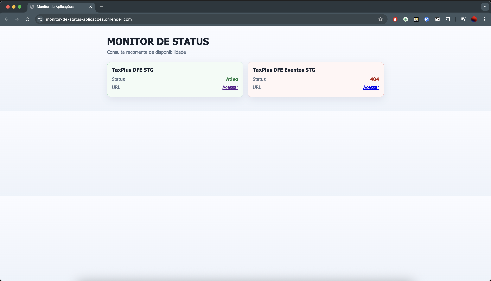

# Pulse Monitor

Monitor simples de status de aplicações, com cards que exibem o nome da aplicação e o estado atual (`Ativo`, `404`, erro ou sem internet).



## Funcionalidades

- Exibe cards com nome da aplicação e status em tempo real
- Atualização recorrente dos status (a cada 30 segundos)
- Destaque visual por estado:
  - Verde: aplicação ativa
  - Vermelho: erro ou `404`
  - Cinza: navegador sem internet
- Backend local para evitar problema de CORS no navegador

## Tecnologias

- HTML
- CSS
- JavaScript (frontend)
- Node.js (backend HTTP simples)

## Estrutura do Projeto

```text
.
├── assets/
│   └── tela-inicial-app.png
├── index.html
├── style.css
├── script.js
├── server.js
├── package.json
└── render.yaml
```

## Como Rodar Localmente

### Pré-requisitos

- Node.js 18 ou superior

### Passos

1. Instale dependências (se necessário):
   ```bash
   npm install
   ```
2. Inicie o servidor:
   ```bash
   npm start
   ```
3. Acesse no navegador:
   ```text
   http://localhost:3000
   ```

## Scripts

- `npm start`: inicia a aplicação
- `npm run dev`: inicia com watch (`node --watch`)

## Deploy no Render

Este projeto já inclui `render.yaml` com configuração de deploy:

- Runtime Node
- Build command: `npm install`
- Start command: `npm start`
- Auto deploy habilitado

Para publicar:

1. Faça push do projeto para o GitHub
2. No Render, escolha `New` -> `Blueprint`
3. Selecione o repositório e aplique

## Observações

- O frontend consulta `/api/check` no backend para contornar CORS.
- As URLs monitoradas ficam definidas no arquivo `server.js`.
